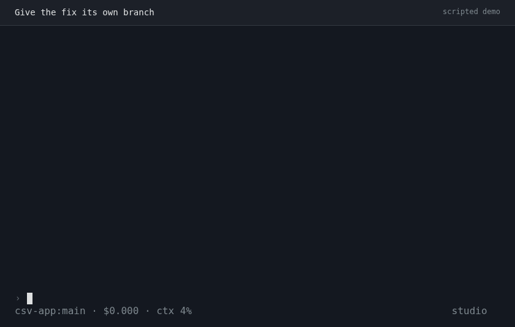
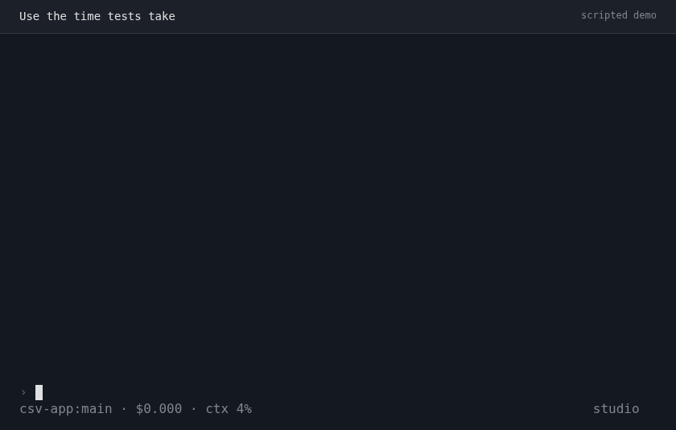
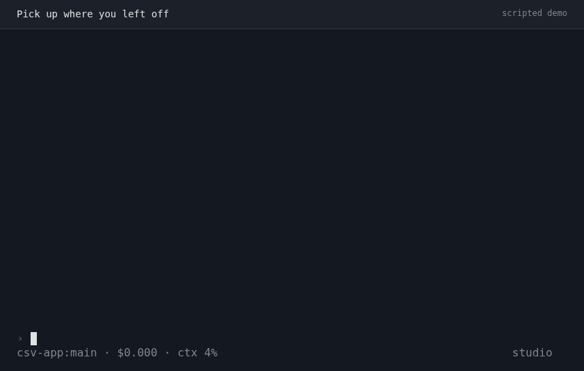
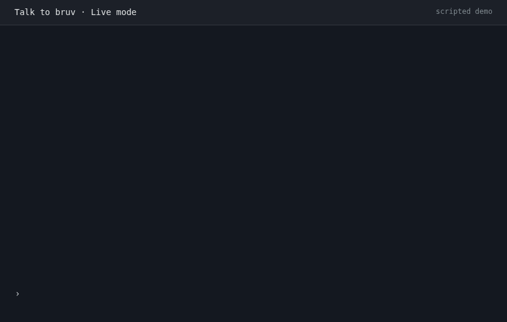

<div align="center">
<p>
  <picture>
    <source media="(prefers-color-scheme: dark)" srcset="site/assets/brand/bruv-wordmark-light.svg">
    
  </picture>
</p>

An opinionated coding agent. Built on [Pi](https://pi.dev).

|  |  |
| --- | --- |
|  |  |

</div>

### Install

> Want a graphical frontend? Follow the [T3 Code setup guide](wisdom/docs/t3-code/README.md).

```sh
curl -fsSL 'https://raw.githubusercontent.com/tnfssc/bruv/develop/scripts/install.sh' | sh
```

Supports Linux x64/arm64, macOS Apple Silicon, and Android Termux arm64 (API 28+).
Requires curl and either sha256sum or shasum.

Put `~/.local/bin` on your PATH, then start Bruv in your project:

```sh
bruv
```

Configure your provider with `/login` and choose a model with `/model`.
Credentials and model access come from your provider; they are not included.

### Updates

```sh
bruv update --check           # Check without changing files
bruv update                   # Update the sibling CLI and connector together
```

### Commands

```sh
bruv                          # Start the interactive terminal
bruv -p "Describe this tree"  # Run one prompt and exit
bruv -c                       # Continue the latest session
bruv -r                       # Pick a saved session to resume
```
