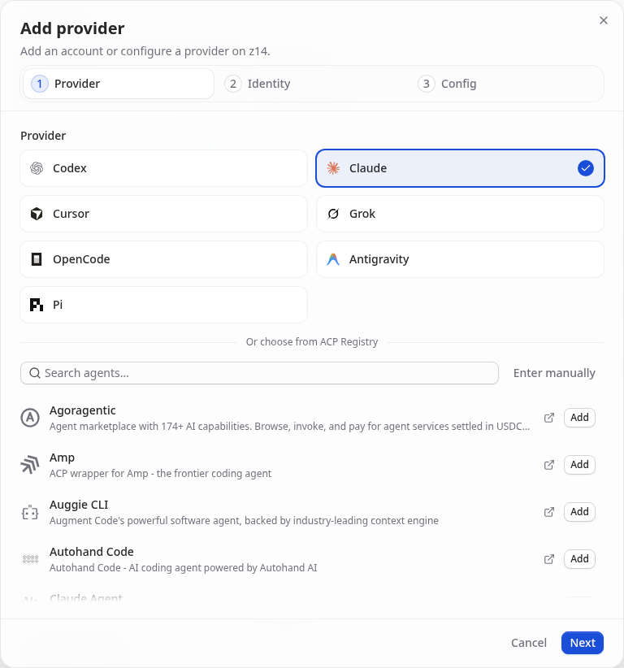
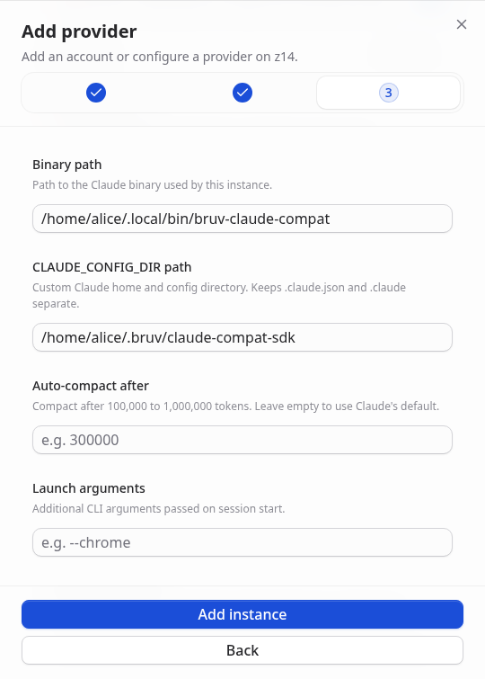
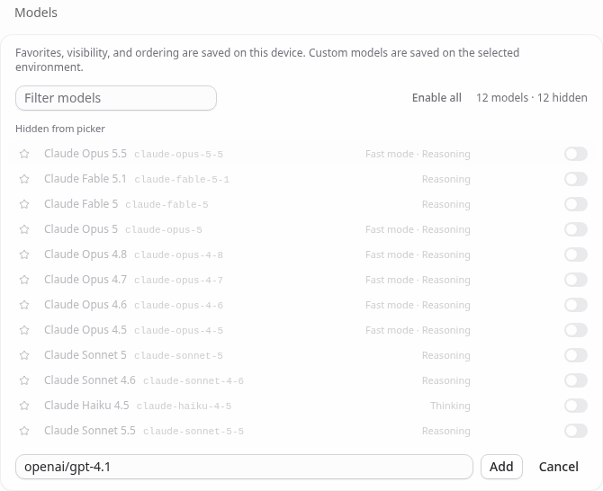
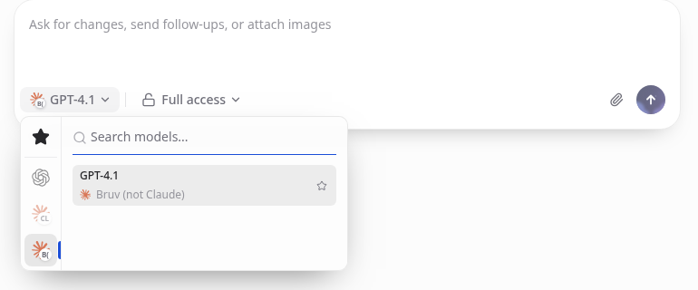

# Use Bruv with T3 Code

Install Bruv and official T3 separately, then connect them in T3 Settings.
For these same steps in your terminal, run **`bruv web`**.
**Claude is the protocol type; Bruv is your instance.** No Claude account is
required by the connector. Your chosen model provider supplies access.

## 1. Install and check Bruv

Stop active Bruv/T3 sessions before installing or replacing binaries.

```sh
curl -fsSL 'https://raw.githubusercontent.com/tnfssc/bruv/develop/scripts/install.sh' | sh
```

The installer verifies and installs the matched `bruv` and
`bruv-claude-compat` pair in `~/.local/bin`. Keep them together. It does not
install T3 or edit your shell profile. Put `~/.local/bin` on your PATH, then check:

```sh
command -v bruv
command -v bruv-claude-compat
bruv --version
bruv-claude-compat --bruv-version
bruv-claude-compat --version
```

The first two commands locate the installed pair. Bruv and the connector’s
`--bruv-version` must report the same product version. The connector’s
`--version` instead reports `2.1.280 (Bruv compatibility; bruv <product version>)`:
a protocol compatibility version, not an installed Claude Code version.

## 2. Configure your provider in ordinary Bruv

Run `bruv` in your project. Use **`/login`** to configure your provider and
**`/model`** to choose a model. Send a small test prompt there first.
Keep credentials out of T3 messages, form fields and screenshots.

By default, the connector shares **`~/.bruv/agent`** with the CLI for auth,
model registry, settings and agent resources. No credential copying or extra
login is needed for the same OS user. Shared settings changes affect both.
The **SDK history home** configured below is separate: it stores native SDK
transcripts, not provider credentials or ordinary CLI history.

## 3. Install official T3 and launch normally

Install T3 separately from [official releases](https://github.com/pingdotgg/t3code/releases)
and verify its published checksums. Open the desktop app normally, or run `t3`
for the web frontend. `bruv web` only prints setup guidance.

**Do not set parent/server/global `CLAUDE_CONFIG_DIR`, change `HOME`, or use
custom T3 launch arguments for this setup.** Leave ordinary Claude state alone.

## 4. Add a separate provider instance named Bruv

In **Settings → Providers**, click **+ (Add provider)**. Select **Claude**,
then **Next**. On **Identity**, name it **Bruv (not Claude)** and choose a
unique instance ID (for example `bruv`). Click **Next** to open **Config**.
Do not edit your existing Claude instance.



In the new instance, enter paths for the machine running the connector:

| Field | Example (replace the username and paths) |
| --- | --- |
| Binary path | `/home/alice/.local/bin/bruv-claude-compat` |
| CLAUDE_CONFIG_DIR path (SDK history home) | `/home/alice/.bruv/claude-compat-sdk` |
| Launch arguments | Leave empty |

Use **absolute paths**, not literal `~` or `$HOME`. The history home field is
instance-local SDK configuration; do not point it at `~/.claude` or the Bruv
auth home. On macOS, for example, use `/Users/alice/...`.
No environment overrides are needed for a normal same-user paired install.
Click **Add instance** to save.



## 5. Add the exact model and set auxiliary models

Add a **custom model** to the Bruv instance using the exact **`provider/model-id`**
from your configured Bruv registry. For example, `openai/gpt-4.1` is valid
**only if that exact entry is configured and accessible through your provider**.
A friendly display name is not the model ID. Click **Add custom model**,
enter the exact ID, then **Add**. Use its edit button if you want a display
name such as `GPT-4.1`. You can hide the built-in Claude models with
**Disable all** before adding your custom model to avoid picking an alias.



Select that same exact ID for **auxiliary models**, including title, branch and
text generation where T3 exposes those settings. Do not leave built-in
`sonnet`/`opus` aliases selected or substitute them for a Bruv model.
If T3 omits a model, the connector needs an explicitly configured default in
the shared Bruv settings; `/model` in ordinary Bruv sets your selection.

## 6. Select Bruv and smoke-test a chat

In a new T3 chat, select the **Bruv instance** and your **exact custom model**
in the model picker. Check both before sending.



Send: **“Reply with one short greeting. Do not use tools.”** Confirm a real
response and check that auxiliary title generation also works. A successful
request demonstrates access for that model at that time; health/readiness
indicators and these screenshots do not. Screenshots show sample form fields,
not proof of provider access.

Screenshots show the real T3 Code **v0.0.46-nightly.20261004.2644** UI
with sample paths and a sample model. Replace them with your own. No real
provider credentials or inference requests were used for these captures.

## Known limits and safe updates

- Official **v0.0.46-nightly.20261004.2644** lacks the provider-scoped SDK
  history fix. Basic chat may work, but native fork can fail in T3 **before
  Bruv starts**. Full UI-only history/fork requires a T3 build with that fix;
  no fixed release is promised here. Do not work around it by changing the
  parent environment or ordinary Claude home.
- After stopping a turn with a pending approval, T3 can leave its cancelled
  card visible. **Decline the stale approval before continuing; do not approve it.**
- Never use T3’s **Claude login, install or updater** for Bruv. A latest-Claude
  update notice or built-in Sonnet advisory is not a requirement for your
  custom model. Update Bruv’s pair with `bruv update` (check with
  `bruv update --check`); stop active sessions first and restart afterward.
  Update T3 independently and recheck history-fix availability.
- If startup fails, recheck the absolute paths, exact model and ordinary Bruv
  auth. T3 may show only a generic error; connector stderr can explain it.

For separate auth homes, remote paths and technical limits, see
[external T3 setup notes](../../wisdom/claude-compat/external-t3-setup.md).
